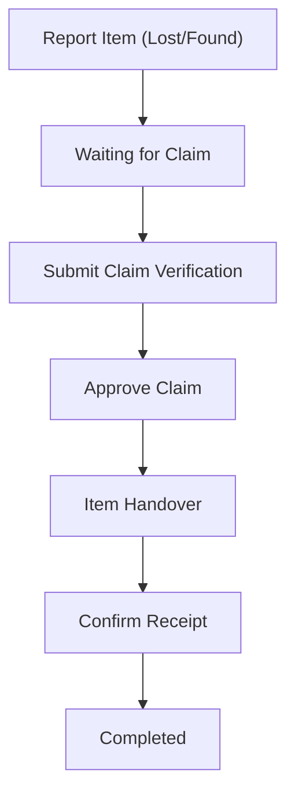

# Foundly - Campus Lost and Found Portal

Foundly is a centralized, interactive campus platform designed to help students, faculty, and staff report lost items, browse found belongings, and claim their lost properties back in a structured, verified manner.

---

## Key Features

* **Secure Authentication**: Registration and login system for campus users to manage their listings securely.
* **Item Directory**: Live dashboard listing lost and found items complete with descriptions, categories, loss dates, and contact details.
* **Search & Filters**: Instant matching using query search and fast filters by item state ("All", "Lost", "Found").
* **Structured Claim Workflows**: Interactive step-by-step timeline tracking the lifecycle of an item:
  1. **Reported**: Item is initially posted.
  2. **Waiting for Claim**: Open for owners to find or claim.
  3. **Verification**: Owner submits claim/finder submits found verification details (proof of ownership).
  4. **Handover**: The item is marked as handed over.
  5. **Completed**: Receiver confirms receipt, and the item is officially returned.
* **Real-time Notifications**: Alert system notifying users of claim requests, approvals, and status transitions.

---

## How It Works (The Lifecycle)



1. **Reporting**: A user logs in and reports an item (categorized as "Lost" or "Found").
2. **Claiming**: If a user recognizes a lost item, they click "Claim This Item" and submit ownership verification details (contact info, proof of ownership).
3. **Verification**: The person who reported the item reviews the submitted claims and approves the correct owner.
4. **Handover**: Once approved, the finder completes the physical handover and marks it in the app.
5. **Confirmation**: The owner confirms receipt, and the claim status changes to Completed.

---

## System Walkthrough & Demo Guide

Foundly's interface is divided into several main interaction states, guiding the user dynamically based on authentication and active claims:

### 1. Authentication View (Access Portal)
* **Login & Sign Up**: Clean interface where users can sign in using their username/email or register a new campus account to manage their reports.

### 2. Main Dashboard (Item List)
* **Status Panels**: Quick-filter buttons to switch between **All Items**, **Lost Listings**, and **Found Listings**.
* **Item Search**: Dynamic text search updating matching cards in real-time.
* **Item Cards**: Displays tag category, date, location details, reporter info, and the current interactive workflow step of the item.

### 3. Claim Form View (Ownership Proof)
* **Form Submission**: Renders a details form requesting physical parameters like proof of ownership, contact details, and loss date to claim an item back.

### 4. Verification Timeline & Controls (Interaction Detail)
* **Timeline Visualization**: Interactive timeline component detailing completed steps (e.g. `REPORTED -> CLAIM_SUBMITTED -> APPROVED -> HANDED_OVER -> COMPLETED`).
* **Creator Panel**: Allows reporters to review claims and approve the correct owner. Allows claimants to track status updates.

---

## How to Run Locally

### Prerequisites
* **Node.js** (v18 or higher recommended)
* **MongoDB** (Local Community Edition running on your machine)

---

### Step 1: Database Setup
Make sure your local MongoDB instance is started and listening on the default port (`27017`).
* On macOS (using Homebrew):
  ```bash
  brew services start mongodb-community
  ```
* On Windows/Linux: Start the MongoDB service or run the `mongod` command in your terminal.

---

### Step 2: Start the Backend Server
1. Navigate to the `backend` folder:
   ```bash
   cd backend
   ```
2. Create or verify the `backend/.env` file exists with the following values:
   ```env
   MONGO_URI=mongodb://127.0.0.1:27017/foundly
   JWT_SECRET=supersecretkeyjwtfoundly
   ```
3. Install dependencies:
   ```bash
   npm install
   ```
4. Start the backend development server:
   ```bash
   npm run dev
   ```
   *(The server will start at `http://localhost:1500`)*

---

### Step 3: Start the Frontend Application
1. Open a **new terminal tab/window** and navigate to the `frontend` folder:
   ```bash
   cd frontend
   ```
2. Install dependencies:
   ```bash
   npm install
   ```
3. Start the Vite React development server:
   ```bash
   npm run dev
   ```
4. Open the URL printed in the terminal (usually `http://localhost:5173`) in your browser to access the portal.
